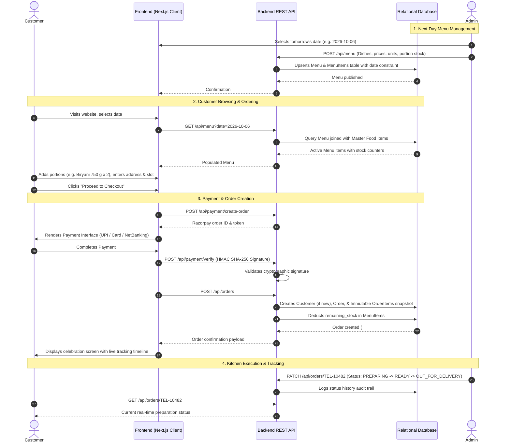

# Vindu Cloud Kitchen — System Architecture

## 1. Overview
**Vindu Ruchulu** is a daily-batch next-day cloud kitchen ordering platform specializing in Telangana and Andhra home-style food. The system is designed around a strictly date-driven culinary model:
`Admin curates next-day menu ➔ Publishes menu ➔ Customers pre-order ➔ Secure Payment ➔ Dawn batch preparation in brass handis ➔ Kitchen manages status & dispatch ➔ Customer tracks live`.

---

## 2. Directory Structure & Separation of Concerns

```
cloudKitchen/
├── frontend/                     # Client Presentation Layer (Next.js 14 + Tailwind)
│   ├── src/
│   │   ├── app/                  # Routes: Home (/), Track (/track-order), Admin (/admin)
│   │   ├── components/           # Editorial UI, Cart Drawer, Food Cards, Date Navigator
│   │   ├── context/              # Cart & Session State Management
│   │   ├── hooks/                # Custom React Hooks
│   │   ├── services/             # HTTP API Client communicating with Backend
│   │   ├── types/                # Frontend Types & View Models
│   │   └── styles/               # Bespoke Design Tokens (Telugu Warm Palette)
│   ├── public/
│   ├── next.config.js
│   ├── tailwind.config.js
│   └── package.json
│
├── backend/                      # API & Business Logic Layer
│   ├── src/
│   │   ├── controllers/          # Request/Response Handlers (Menu, Orders, Items, Payment)
│   │   ├── routes/               # Clean Express/Next.js API Route Handlers
│   │   ├── services/             # Core Business & Inventory Rules
│   │   ├── middleware/           # Auth, Validation, CORS, Error Handling
│   │   ├── models/               # Data Transfer Objects & Validation Schemas
│   │   ├── config/               # Environment & Gateway Config (Razorpay)
│   │   └── utils/                # Crypto HMAC signature & formatters
│   └── package.json
│
├── database/                     # Persistence Layer
│   ├── schema/
│   │   └── schema.sql            # Normalized Relational Schema
│   ├── seed/
│   │   └── seed.ts               # Production-grade 17+ Authentic Telangana/Andhra Dishes
│   └── db.ts                     # Relational Database Engine with Foreign Keys & ACID locks
│
├── docs/                         # Technical Documentation
│   ├── ARCHITECTURE.md
│   ├── API.md
│   ├── DATABASE.md
│   └── SETUP.md
│
├── .env.example
├── README.md
└── package.json
```

---

## 3. Data Flow Architecture



---

## 4. Key Architectural Guarantees
1. **Immutable Order Snapshots**: When a customer places an order, the exact food name, unit (`500 g`, `1 plate`, etc.), unit price (`₹250`), and quantity are stored directly on the `order_items` table. Future price or unit edits by the admin on the master food catalog never corrupt past financial records.
2. **Date-Based Separation**: Each menu belongs to a specific date (`menu_date = 'YYYY-MM-DD'`). Menus are distinct and can be scheduled, drafted, duplicated, or published independently.
3. **Automated Stock Depletion**: Order placements immediately decrement `remaining_stock` on the target day's `menu_items`. If stock hits `0`, the status shifts automatically to `SOLD_OUT`, preventing overbooking.
4. **Zero Frontend-Database Coupling**: The frontend communicates strictly via HTTP API contracts.
